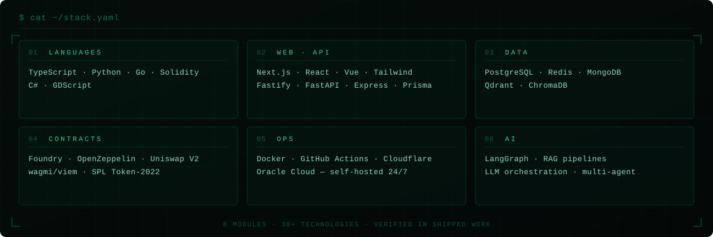

  

**I build and run software products end to end** — contracts, backend, ops, and the boring parts that keep them alive 24/7. Based in Adana, Türkiye.

## Stack

---

🌐 **[oguzhanbaysal.vercel.app](https://oguzhanbaysal.vercel.app/)** — portfolio · 🧱 **[LaunchpadKit](https://launchpadkit.dev)** — deployable launchpad infrastructure for new EVM chains.

📫 **[oguzhanbaysal@outlook.com](mailto:oguzhanbaysal@outlook.com)** · 📍 Adana, Türkiye

Türkçe: yazılım ürünlerini uçtan uca kurup işletiyorum — kontratlar, backend, ops. İş birliği için yazabilirsiniz.
